# Constrained Mechanics Solvers: Structure-Preserving MOR Framework

This repository contains Python implementations of structure-preserving solvers for constrained mechanical systems. It includes functionality for full-order simulations as well as Model Order Reduction (MOR) using techniques like POD, DEIM, and MDEIM.

## Features

*   **Solvers**:
    *   Energy-momentum preserving Discrete Gradient (DG) solvers for constrained Lagrangian formulations.
    *   Symplectic Conformal Störmer-Verlet (CSV / RATTLE) for constrained Hamiltonian formulations.
    *   Conformal Implicit Midpoint (IM) symplectic solvers.
*   **Model Order Reduction**:
    *   Proper Orthogonal Decomposition (POD) for kinematic/momentum coordinates.
    *   Discrete Empirical Interpolation Method (DEIM) for nonlinear vector fields.
    *   Matrix DEIM (MDEIM) for hyper-reduction of Hessians, Jacobian matrices, and constraint variations.
    *   Windowed traveling bases with online basis switching and adaptive constraint normal-space enrichment.
*   **Architecture & Performance**:
    *   Unified solver hierarchy (Path C) with zero-branching polymorphic dispatch in hot inner loops.
    *   Centralized simulation configuration in `src/System.py`.
    *   Parallel execution support using `dask` and `dask_jobqueue` (SLURM integration).

## Architecture Overview

The codebase follows an object-oriented, structure-preserving design separating physical system formulations, reduction algorithms, and numerical time integrators.

```mermaid
flowchart TD
    subgraph Physics["Physics Formulation Hierarchy"]
        MechSystem["MechSystem"]
        HamiltonianMechSystem["HamiltonianMechSystem"]
        LagrangianMechSystem["LagrangianMechSystem"]
        ReducedHamiltonianMechSystem["ReducedHamiltonianMechSystem"]
        ReducedLagrangianMechSystem["ReducedLagrangianMechSystem"]
        HyperReducedHamiltonianMechSystem["HyperReducedHamiltonianMechSystem"]
        HyperReducedLagrangianMechSystem["HyperReducedLagrangianMechSystem"]

        MechSystem --> HamiltonianMechSystem
        MechSystem --> LagrangianMechSystem
        HamiltonianMechSystem --> ReducedHamiltonianMechSystem
        LagrangianMechSystem --> ReducedLagrangianMechSystem
        ReducedHamiltonianMechSystem --> HyperReducedHamiltonianMechSystem
        ReducedLagrangianMechSystem --> HyperReducedLagrangianMechSystem
    end

    subgraph Reduction["Model Reduction"]
        ReduceMechSystem["ReduceMechSystem"]
        HamiltonianReducer["HamiltonianReducer"]
        DiscreteGradientReducer["DiscreteGradientReducer"]

        MechSystem --> ReduceMechSystem
        ReduceMechSystem --> HamiltonianReducer
        ReduceMechSystem --> DiscreteGradientReducer
    end

    subgraph Solvers["Structure-Preserving Solvers (Path C)"]
        BaseSolverMixin["BaseSolverMixin"]
        ReducedSolverMixin["ReducedSolverMixin"]
        HyperReducedSolverMixin["HyperReducedSolverMixin"]

        DiscreteGradientSolver["DiscreteGradientSolver (FOM)"]
        ReducedDiscreteGradientSolver["ReducedDiscreteGradientSolver (ROM)"]
        HyperReducedDiscreteGradientSolver["HyperReducedDiscreteGradientSolver (HROM)"]

        ConformalStormerVerletSolver["ConformalStormerVerletSolver (FOM)"]
        ReducedConformalStormerVerletSolver["ReducedConformalStormerVerletSolver (ROM)"]
        HyperReducedConformalStormerVerletSolver["HyperReducedConformalStormerVerletSolver (HROM)"]

        BaseSolverMixin --> DiscreteGradientSolver
        BaseSolverMixin --> ConformalStormerVerletSolver

        ReducedSolverMixin --> ReducedDiscreteGradientSolver
        DiscreteGradientSolver --> ReducedDiscreteGradientSolver
        ReducedLagrangianMechSystem --> ReducedDiscreteGradientSolver

        HyperReducedSolverMixin --> HyperReducedDiscreteGradientSolver
        ReducedDiscreteGradientSolver --> HyperReducedDiscreteGradientSolver
        HyperReducedLagrangianMechSystem --> HyperReducedDiscreteGradientSolver

        ReducedSolverMixin --> ReducedConformalStormerVerletSolver
        ConformalStormerVerletSolver --> ReducedConformalStormerVerletSolver
        ReducedHamiltonianMechSystem --> ReducedConformalStormerVerletSolver

        HyperReducedSolverMixin --> HyperReducedConformalStormerVerletSolver
        ReducedConformalStormerVerletSolver --> HyperReducedConformalStormerVerletSolver
        HyperReducedHamiltonianMechSystem --> HyperReducedConformalStormerVerletSolver
    end

    linkStyle default stroke-width:2px;
```



### Projection Operators Nomenclature

The codebase uses canonical, domain-specific names for all interpolation and projection operators:

| Canonical Name | Legacy Alias | Description |
|---|---|---|
| `deim_field` | `RBxUx_inv_PxU` | DEIM projection-interpolation matrix for the vector field: $V_r^T U_f (P^T U_f)^{-1}$ |
| `mdeim_Hessian` | `IP_Ux_inv_PxU` | Sparse MDEIM projection matrix for system Hessians: $U_j (P_j^T U_j)^{-1}$ |
| `mdeim_g_prime` | `_IP_Ux_inv_PxU` | Sparse MDEIM projection matrix for the constraint Jacobian $\nabla g$ |
| `mdeim_g_var` | `IP_g_prime_x_lambda_y` | Sparse MDEIM projection for constraint variation $g' \cdot \lambda \cdot y$ (DG) |

All operators support windowed variants (`*_windows`) for traveling basis simulations, and bidirectional properties ensure full backward compatibility with legacy checkpoints.

## Installation

It is recommended to install the project and its dependencies in a dedicated virtual environment.

1.  Clone the repository:
    ```bash
    git clone https://github.com/ashishbhatt8050/constrained_mechanics.git
    cd constrained_mechanics
    ```

2.  Create and activate a conda environment:
    ```bash
    conda create --name modred-dae-torch python=3.11
    conda activate modred-dae-torch
    ```

3.  Install the project in editable mode:
    ```bash
    pip install -e .
    ```

## Usage

The repository includes two main benchmark applications:

1. **Constrained Particle Lattice (`scripts/app8_lattice.py`)**:
   Simulates coupled harmonic and nonlinear oscillator chains subject to holonomic distance constraints.
2. **Discrete Euler Elastica (`scripts/app9_elastica.py`)**:
   Simulates geometrically exact discrete elastica beams under large deformations with inextensibility constraints.

### Running Simulations

To run the lattice benchmark locally:
```bash
python scripts/app8_lattice.py
```

To run the discrete elastica benchmark:
```bash
python scripts/app9_elastica.py
```

Useful command-line options:
* `--clean`: Remove existing checkpoints and recompute solutions from scratch.
* `--no-latex`: Disable LaTeX font rendering for matplotlib plots (useful for fast headless execution).
* `--clear-cache`: Clear cached joblib computations.
* `--clear-symbolic`: Recompute SymPy symbolic expressions.

### Running on a SLURM Cluster

A submission script is provided for HPC clusters:
```bash
sbatch submit_job_slurm.sh
```

To monitor an active or recent job:
```bash
./submit_job_slurm.sh monitor
```

### Running the Symbolics Benchmark

To benchmark symbolic computation and code-generation strategies:
```bash
python scripts/benchmark_symbolics.py
```

## Contribution Guide

To extend the framework:
* **Define new physics models**: Extend `MechSystem` and update symbolic expressions in `src/SymbolicComputer.py` (or `src/ElasticaSymbolicComputer.py`).
* **Add time integrators**: Inherit from `BaseSolverMixin` in `src/ConcreteSolvers.py` and extend `src/ODESolver.py`.
* **Add reduction algorithms**: Implement new POD/DEIM/MDEIM routines in `src/ReduceMechSystem.py`.

## Citation

If you use this software in your research, please cite it using the metadata provided in `CITATION.cff` or via the Zenodo DOI associated with this release.

## License

This project is licensed under the MIT License - see the LICENSE file for details.

## Authors

*   Ashish Bhatt

## Acknowledgements

This repository is forked from [scipro-primer](https://github.com/hplgit/scipro-primer) by Hans Petter Langtangen.