# Constrained Mechanics Solvers: Structure-Preserving MOR Framework

This repository contains Python implementations of structure-preserving solvers for constrained mechanical systems. It includes functionality for full-order simulations as well as Model Order Reduction (MOR) using techniques like POD, DEIM, and MDEIM.

## Features

*   **Solvers**:
    *   Energy-momentum preserving Discrete Gradient (DG) solvers for constrained Lagrangian formulation.
    *   Symplectic RATTLE for constrained Hamiltonian formulation.
*   **Model Reduction**:
    *   Proper Orthogonal Decomposition (POD)
    *   Discrete Empirical Interpolation Method (DEIM)
    *   Sparse Matrix DEIM (SMDEIM) for hyper-reduction of nonlinearities and constraints both
*   **Performance**:
    *   Parallel execution support using `dask` and `dask_jobqueue` (SLURM integration).
    *   Centralized configuration for simulation parameters in `src/System.py`.

## Architecture overview

The core codebase follows a hierarchical class design centered on system configuration, physics definition, reduction, and solver integration.

```mermaid
flowchart TD
    MechSystem[MechSystem]
    HamiltonianMechSystem[HamiltonianMechSystem]
    LagrangianMechSystem[LagrangianMechSystem]
    ReduceMechSystem[ReduceMechSystem]
    HamiltonianReducer[HamiltonianReducer]
    DiscreteGradientReducer[DiscreteGradientReducer]
    ReducedHamiltonianMechSystem[ReducedHamiltonianMechSystem]
    ReducedLagrangianMechSystem[ReducedLagrangianMechSystem]
    HyperReducedHamiltonianMechSystem[HyperReducedHamiltonianMechSystem]
    HyperReducedLagrangianMechSystem[HyperReducedLagrangianMechSystem]
    ODESolver[ODESolver]
    ConformalStormerVerlet[ConformalStormerVerlet]
    DiscreteGradient[DiscreteGradient]
    ConformalStormerVerletSolver[ConformalStormerVerletSolver]
    DiscreteGradientSolver[DiscreteGradientSolver]

    MechSystem --> HamiltonianMechSystem
    MechSystem --> LagrangianMechSystem
    MechSystem --> ReduceMechSystem
    ReduceMechSystem --> HamiltonianReducer
    HamiltonianMechSystem --> HamiltonianReducer
    ReduceMechSystem --> DiscreteGradientReducer
    LagrangianMechSystem --> DiscreteGradientReducer
    HamiltonianMechSystem --> ReducedHamiltonianMechSystem
    LagrangianMechSystem --> ReducedLagrangianMechSystem
    ReducedHamiltonianMechSystem --> HyperReducedHamiltonianMechSystem
    ReducedLagrangianMechSystem --> HyperReducedLagrangianMechSystem
    ODESolver --> DiscreteGradient
    ODESolver --> ConformalStormerVerlet
    DiscreteGradient --> DiscreteGradientSolver
    LagrangianMechSystem --> DiscreteGradientSolver
    ConformalStormerVerlet --> ConformalStormerVerletSolver
    HamiltonianMechSystem --> ConformalStormerVerletSolver


    classDef lagrangian fill:#e6f7ff,stroke:#1f77b4,stroke-width:1px;
    classDef hamiltonian fill:#fff2cc,stroke:#d95f02,stroke-width:1px;
    class LagrangianMechSystem,DiscreteGradient,DiscreteGradientSolver,DiscreteGradientReducer,ReducedLagrangianMechSystem,HyperReducedLagrangianMechSystem lagrangian;
    class HamiltonianMechSystem,ConformalStormerVerlet,ConformalStormerVerletSolver,HamiltonianReducer,ReducedHamiltonianMechSystem,HyperReducedHamiltonianMechSystem hamiltonian;
```



- `MechSystem` defines system physics and constraints.
- `ReduceMechSystem` adds POD/DEIM/MDEIM reduction on top of `MechSystem`.
- `ODESolver` provides the generic solver framework used by concrete integrators.

## Installation

It is highly recommended to install the project and its dependencies in a dedicated virtual environment to avoid conflicts with other projects. This project uses `conda` for environment management.

1.  Clone the repository:
    ```bash
    git clone https://github.com/ashishbhatt8050/constrained_mechanics.git
    cd constrained_mechanics
    ```

2.  Create and activate a new conda environment (e.g., named `constrained_mechanics_env`):
    ```bash
    conda create --name constrained_mechanics_env python=3.11
    conda activate constrained_mechanics_env
    ```

3.  Install the project in "editable" mode. This command reads the `pyproject.toml` file, installs all required dependencies into your active environment, and makes your local source code available on your Python path.
    ```bash
    pip install -e .
    ```

## Usage

The main driver script is `scripts/app8_lattice.py`. All core simulation parameters (number of oscillators, final time, etc.) are now centralized in the `SysConfig` class within `src/System.py`. Select between prediction and reproduction experiment therein.

### Running the Main Simulation

To run the simulation on a HPC cluster using SLURM (edit the script according to your cluster configuration and available resources):
```bash
sbatch submit_job_slurm.sh
```

To run the simulation:
```bash
python scripts/app8_lattice.py
```

To run the simulation and clear any previous checkpoints:
```bash
python scripts/app8_lattice.py --clean
```

To run without using LaTeX for plot rendering:
```bash
python scripts/app8_lattice.py --no-latex
```

### Running the Symbolics Benchmark

A script for benchmarking different symbolic computation strategies is available. 
```bash
python scripts/benchmark_symbolics.py
```

## Debugging

You can selectively disable parts of the simulation for easier debugging.

### Running on a Local Machine

The script automatically detects if the `sbatch` command is available. If not, it defaults to using `dask.distributed.LocalCluster`. To force local execution on a machine that has SLURM, you can temporarily modify the check in `scripts/app8_lattice.py`:

```python
# In scripts/app8_lattice.py, change this line:
if False and shutil.which('sbatch') and not "PYTEST_CURRENT_TEST" in os.environ:
#  ^ Change to False to disable SLURM detection
```

*Note: The script is configured to use a SLURM cluster by default. Ensure you adjust the `dask` client configuration in the `__main__` block of the script according to your own cluster configuration.*

## Contribution guide

To extend the project, start from the area that best matches your goal:
*   Define new system physics by updating the Hamiltonian, Lagrangian, and constraint expressions in `src/SymbolicComputer.py`
*   Add new time integrators or solver logic in `src/ConcreteSolvers.py` and extend the base framework in `src/ODESolver.py`
*   Implement custom model reduction or hyper-reduction workflows in `src/ReduceMechSystem.py`

Aim to keep new code consistent with the existing simulation and reduction patterns, and include tests or example usage when possible.

## Citation

If you use this software in your research, please cite it using the metadata provided in `CITATION.cff` or via the Zenodo DOI associated with this release.

## License

This project is licensed under the MIT License - see the LICENSE file for details.

## Authors

*   Ashish Bhatt

## Acknowledgements

This repository is forked from [scipro-primer](https://github.com/hplgit/scipro-primer) by Hans Petter Langtangen.